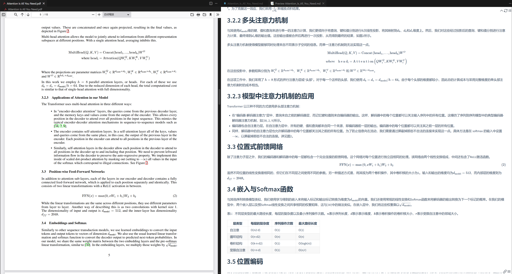

**Language:** | **English** | [简体中文](README.zh.md) |

<div align="center">

# 📚 LocalScholar-Flow

### 🌟 A Local Academic Paper Processing & Translation Workflow

[](https://www.python.org/)
[](LICENSE)
[](https://www.docker.com/)

**Convert PDF papers to Markdown and translate them using local AI models**

</div>

---

## ✨ Features

### 📄 PDF to Markdown Conversion
- Convert academic PDF papers to Markdown format
- Preserve formatting, images, and mathematical formulas
- Powered by [MinerU](https://github.com/opendatalab/MinerU) - An advanced PDF parsing tool

**Example Output:**


### 🌐 AI Translation
- Translate academic papers using local models
- Preserve document structure and technical accuracy
- Powered by [HY-MT](https://github.com/Tencent-Hunyuan/HY-MT) - Tencent's translation model

**Example Output:**




### 💾 State Management
- Track processing status using MongoDB
- Resume from where you left off
- No duplicate work

### ⚡ Batch Processing
- Process multiple papers simultaneously
- Efficient resource utilization
- Progress tracking for each paper

### 🐳 Docker Support
- All services run in Docker containers
- Easy deployment and setup
- Isolated environment for dependencies

### 🌍 Cross-Platform Support
- Works on Linux, Windows, and macOS
- Automatic path handling for different operating systems
- Smart symlink management for Docker compatibility

---

## 🛠️ Installation

### Prerequisites

- Docker and Docker Compose
- NVIDIA GPU with CUDA support
- At least 20GB disk space for models
- Conda (optional but recommended)

### Quick Start

1. **Clone the repository**
   ```bash
   git clone https://github.com/littleBu0210/LocalScholar-Flow.git
   cd LocalScholar-Flow
   ```

2. **Create Conda environment** (optional)
   ```bash
   conda create -n LocalScholar-Flow python=3.10
   conda activate LocalScholar-Flow
   pip install -r requirements.txt
   ```

3. **Download models**

   ```bash
   # From ModelScope (default, recommended for users in China)
   python scripts/download_models.py

   # From HuggingFace
   python scripts/download_models.py --source huggingface
   ```

   This downloads:
   - **MinerU VLM model** (~2GB) for PDF parsing
   - **Hunyuan model** (~3.6GB) for translation

   After completion, ensure the `models` folder contains:
   - `MinerU-VLM` folder
   - `HY-MT1.5-1.8B` folder
   - `mineru.json` file

4. **Setup Docker services**

   ```bash
   docker compose build
   docker compose up -d
   ```

   This will:
   - Build MinerU and Hunyuan Docker images
   - Start MongoDB, MinerU, and Hunyuan services

---

## 🚀 Usage

### Prerequisites Check

Before processing papers, ensure all Docker services are running properly:

```bash
# Check service health status
python scripts/check_service.py
```

This script will monitor and verify:
- MongoDB connection (port 27016)
- MinerU service (port 8000)
- Hunyuan translation model (port 8001)

Wait until all services show `✅` status before proceeding.

### Simple Workflow

1. **Place PDF papers** in the `pdfs/` directory:
   ```bash
   cp /path/to/your/papers/*.pdf pdfs/
   ```

2. **Run the complete workflow**

   ```bash
   python scripts/run_all.py
   ```

   This automatically:
   - Scans PDFs and generates processing state
   - Converts PDFs to Markdown
   - Translates Markdown files

### Individual Steps

You can also run each step separately:

```bash
# Generate state from PDFs
python src/generate_state.py

# Convert PDF to Markdown
python src/pdf_to_md.py

# Translate Markdown
python src/translate_md.py
```

### Output Structure

```
LocalScholar-Flow/
├── pdfs/              # Input PDF files
├── output/
│   ├── pdf2md/       # Converted Markdown files
│   └── mdTrans/      # Translated Markdown files
└── workspace/        # Temporary workspace
```

---

## ⚙️ Configuration

Edit [json/config.json](json/config.json) to customize settings:

```json
{
    "mongodb": {
        "host": "localhost",
        "port": 27016,
        "database": "paper_flow",
        "collection": "papers"
    },
    "paths": {
        "pdf_dir": "./pdfs",
        "pdf2md_dir": "./output/pdf2md",
        "mdTrans_dir": "./output/mdTrans"
    },
    "translation": {
        "base_url": "http://localhost:8001/v1/chat/completions",
        "model": "hunyuan",
        "target_language": "Chinese",
        "max_text_length": 3000,
        "max_requests_per_second": 5
    }
}
```

---

## 🐳 Docker Services

### Service Management

```bash
# Start all services
docker compose up -d

# Stop all services
docker compose down

# View service logs (check if services started successfully)
docker compose logs -f

# Restart a specific service (e.g., restart translation model)
docker compose restart hunyuan
```

### Service Endpoints

- **MongoDB**: `localhost:27016`
- **MinerU API**: `http://localhost:8000`
- **Hunyuan API**: `http://localhost:8001`

---

## 📁 Project Structure

```
LocalScholar-Flow/
├── src/
│   ├── generate_state.py   # Scan PDFs and generate state
│   ├── pdf_to_md.py        # Convert PDF to Markdown
│   ├── translate_md.py     # Translate Markdown files
│   └── database.py         # MongoDB operations
├── scripts/
│   ├── download_models.py  # Download models (cross-platform)
│   ├── setup_services.py   # Docker services setup (cross-platform)
│   └── run_all.py          # Main workflow (cross-platform)
├── tools/
│   ├── mineru/             # MinerU Docker configuration
│   └── hunyuan/            # Hunyuan Docker configuration
├── json/
│   └── config.json         # Configuration file
├── pdfs/                   # Input PDF files
├── output/                 # Output directory
│   ├── pdf2md/             # Converted Markdown files
│   └── mdTrans/            # Translated Markdown files
├── models/                 # Model files directory
├── compose.yaml            # Docker Compose configuration
└── requirements.txt        # Python dependencies
```

---

## 🔧 Troubleshooting

### Services Not Starting

Check if Docker has enough GPU memory:
```bash
docker compose logs mineru
docker compose logs hunyuan
```

### MongoDB Connection Issues

Check if MongoDB is running:
```bash
docker compose ps mongodb
docker compose logs mongodb
```

---

## 📦 Requirements

### Python Dependencies

- `pymongo`: MongoDB client
- `aiohttp`: Async HTTP client
- `requests`: HTTP library
- `loguru`: Logging
- `modelscope` or `huggingface_hub`: Model download

### System Requirements

- **GPU**: NVIDIA GPU with 8GB+ VRAM
- **RAM**: 16GB+ recommended
- **Disk**: 20GB+ for models and processing
- **OS**: Linux/Windows/macOS (cross-platform Python scripts)

---

## 🙏 Acknowledgments

This project is built upon excellent open-source tools:

- **[MinerU](https://github.com/opendatalab/MinerU)** - PDF parsing and Markdown conversion
- **[HY-MT](https://github.com/Tencent-Hunyuan/HY-MT)** - Translation model by Tencent
- **vLLM** - LLM serving engine

---

## 📄 License

MIT License - feel free to use this project for your own research and projects!

---

<div align="center">

## ⭐ Star History

[](https://star-history.com/#littleBu0210/LocalScholar-Flow&Date)

### If you find LocalScholar-Flow useful, please star it on GitHub! ⭐

**Your support is greatly appreciated! 🙏**

Made with ❤️ by the LocalScholar-Flow community

</div>
