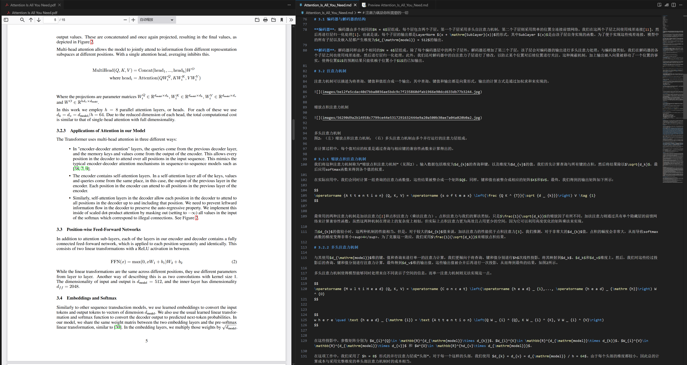
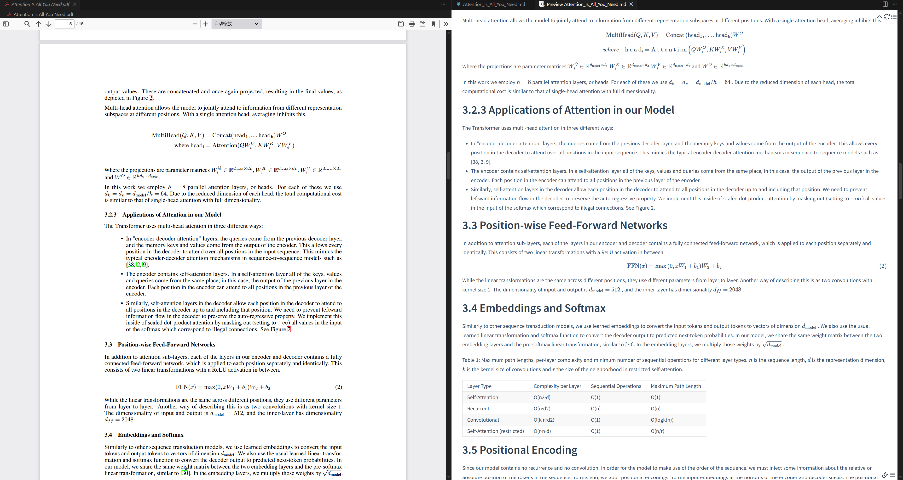

**语言:** | **[English](README.md)** | 简体中文 |

<div align="center">

# 📚 LocalScholar-Flow

### 🌟 本地学术论文处理与翻译工作流

[](https://www.python.org/)
[](LICENSE)
[](https://www.docker.com/)

**使用本地AI模型将PDF论文转换为Markdown并进行翻译**

</div>

---

## ✨ 功能特性

### 📄 PDF 转 Markdown
- 将学术论文PDF转换为Markdown格式
- 保留格式、图片和数学公式
- 基于 [MinerU](https://github.com/opendatalab/MinerU) - 先进的PDF解析工具

**输出示例：**


### 🌐 AI 翻译
- 使用本地模型翻译学术论文
- 保留文档结构和技术准确性
- 基于 [HY-MT](https://github.com/Tencent-Hunyuan/HY-MT) - 腾讯翻译模型

**输出示例：**



### 💾 状态管理
- 使用MongoDB跟踪处理状态
- 支持断点续传
- 避免重复工作

### ⚡ 批量处理
- 同时处理多篇论文
- 高效资源利用
- 每篇论文独立进度跟踪

### 🐳 Docker 支持
- 所有服务运行在Docker容器中
- 简化部署和设置
- 依赖隔离环境

### 🌍 跨平台支持
- 支持 Linux、Windows 和 macOS
- 自动处理不同操作系统的路径
- 智能符号链接管理，确保 Docker 兼容性

---

## 🛠️ 安装

### 前置要求

- Docker 和 Docker Compose
- 支持CUDA的NVIDIA GPU
- 至少20GB磁盘空间用于模型
- Conda（可选但推荐）

### 快速开始

1. **克隆仓库**
   ```bash
   git clone https://github.com/littleBu0210/LocalScholar-Flow.git
   cd LocalScholar-Flow
   ```

2. **创建Conda环境**（可选）
   ```bash
   conda create -n LocalScholar-Flow python=3.10
   conda activate LocalScholar-Flow
   pip install -r requirements.txt
   ```

3. **下载模型**

   ```bash
   # 从 ModelScope 下载（默认，推荐中国用户）
   python scripts/download_models.py

   # 从 HuggingFace 下载
   python scripts/download_models.py --source huggingface
   ```

   这将下载：
   - **MinerU VLM 模型** (~2GB) 用于PDF解析
   - **混元模型** (~3.6GB) 用于翻译

   执行完毕后，确保 `models` 文件夹下有：
   - `MinerU-VLM` 文件夹
   - `HY-MT1.5-1.8B` 文件夹
   - `mineru.json` 文件

4. **设置Docker服务**

   ```bash
   docker compose build
   docker compose up -d
   ```

   这将：
   - 构建MinerU和混元Docker镜像
   - 启动MongoDB、MinerU和混元服务

---

## 🚀 使用方法

### 前置检查

处理论文前，请确保所有 Docker 服务正常运行：

```bash
# 检查服务健康状态
python scripts/check_service.py
```

此脚本将监控并验证：
- MongoDB 连接（端口 27016）
- MinerU 服务（端口 8000）
- 混元翻译模型（端口 8001）

等待所有服务显示 `✅` 状态后再继续。

### 简单工作流

1. **将PDF论文放入** `pdfs/` 目录：
   ```bash
   cp /path/to/your/papers/*.pdf pdfs/
   ```

2. **运行完整工作流**

   ```bash
   python scripts/run_all.py
   ```

   这将自动：
   - 扫描PDF并生成处理状态
   - 将PDF转换为Markdown
   - 翻译Markdown文件

### 单独步骤

你也可以分别运行每个步骤：

```bash
# 从PDF生成状态
python src/generate_state.py

# 将PDF转换为Markdown
python src/pdf_to_md.py

# 翻译Markdown
python src/translate_md.py
```

### 输出结构

```
LocalScholar-Flow/
├── pdfs/              # 输入PDF文件
├── output/
│   ├── pdf2md/       # 转换后的Markdown文件
│   └── mdTrans/      # 翻译后的Markdown文件
└── workspace/        # 临时工作空间
```

---

## ⚙️ 配置

编辑 [json/config.json](json/config.json) 自定义设置：

```json
{
    "mongodb": {
        "host": "localhost",
        "port": 27016,
        "database": "paper_flow",
        "collection": "papers"
    },
    "paths": {
        "pdf_dir": "./pdfs",
        "pdf2md_dir": "./output/pdf2md",
        "mdTrans_dir": "./output/mdTrans"
    },
    "translation": {
        "base_url": "http://localhost:8001/v1/chat/completions",
        "model": "hunyuan",
        "target_language": "Chinese",
        "max_text_length": 3000,
        "max_requests_per_second": 5
    }
}
```

---

## 🐳 Docker 服务

### 服务管理

```bash
# 启动所有服务
docker compose up -d

# 停止所有服务
docker compose down

# 查看日志（查看服务是否启动成功）
docker compose logs -f

# 重启特定服务（例如重启翻译模型）
docker compose restart hunyuan
```

### 服务端点

- **MongoDB**: `localhost:27016`
- **MinerU API**: `http://localhost:8000`
- **混元 API**: `http://localhost:8001`

---

## 📁 项目结构

```
LocalScholar-Flow/
├── src/
│   ├── generate_state.py   # 扫描PDF并生成状态
│   ├── pdf_to_md.py        # 将PDF转换为Markdown
│   ├── translate_md.py     # 翻译Markdown文件
│   └── database.py         # MongoDB操作
├── scripts/
│   ├── download_models.py  # 模型下载（跨平台）
│   ├── setup_services.py   # Docker服务设置（跨平台）
│   └── run_all.py          # 主工作流（跨平台）
├── tools/
│   ├── mineru/             # MinerU Docker配置
│   └── hunyuan/            # 混元 Docker配置
├── json/
│   └── config.json         # 配置文件
├── pdfs/                   # 输入PDF文件
├── output/                 # 输出目录
│   ├── pdf2md/             # 转换后的Markdown文件
│   └── mdTrans/            # 翻译后的Markdown文件
├── models/                 # 模型文件目录
├── compose.yaml            # Docker Compose配置
└── requirements.txt        # Python依赖
```

---

## 🔧 故障排除

### 服务无法启动

检查Docker是否有足够的GPU内存：
```bash
docker compose logs mineru
docker compose logs hunyuan
```

### MongoDB 连接问题

检查MongoDB是否正在运行：
```bash
docker compose ps mongodb
docker compose logs mongodb
```

---

## 📦 系统要求

### Python 依赖

- `pymongo`: MongoDB客户端
- `aiohttp`: 异步HTTP客户端
- `requests`: HTTP库
- `loguru`: 日志记录
- `modelscope` 或 `huggingface_hub`: 模型下载

### 系统要求

- **GPU**: 8GB+ 显存的NVIDIA GPU
- **内存**: 推荐16GB+
- **磁盘**: 20GB+ 用于模型和处理
- **操作系统**: Linux/Windows/macOS（跨平台Python脚本）

---

## 🙏 致谢

本项目基于优秀的开源工具构建：

- **[MinerU](https://github.com/opendatalab/MinerU)** - PDF解析和Markdown转换
- **[HY-MT](https://github.com/Tencent-Hunyuan/HY-MT)** - 腾讯翻译模型
- **vLLM** - LLM服务引擎

---

## 📄 许可证

MIT License - 欢迎将此项目用于您的研究和项目！

---

<div align="center">

## ⭐ Star 历史

[](https://star-history.com/#littleBu0210/LocalScholar-Flow&Date)

### 如果 LocalScholar-Flow 对你有帮助，请在 GitHub 上给个 Star！⭐

**非常感谢你的支持！🙏**

由 LocalScholar-Flow 社区用 ❤️ 制作

</div>
